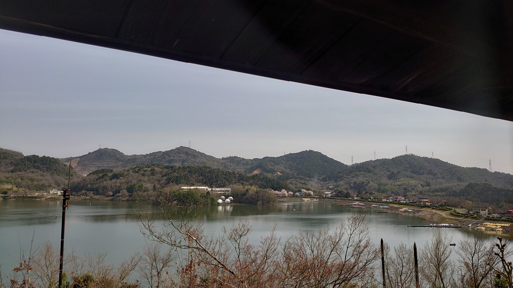

# promoter

## 問題文

画像に写っている池沼を開拓した発起人の父親の命日を答えよ。  
Flag形式: `Diver24{yyyy/MM/dd}`

The pond in the image was cultivated by a certain person who initiated the development in 1628 (Kan'ei 5, 寛永5年). Give the date of death of this person's father.
Flag Format: Diver24{yyyy/MM/dd}

Note: "Kan'ei" (寛永) is one of Japanese era name. (wikipedia)

## 難易度

easy / 184 point (90 solves)

## 自分の解法
どうせEXIF情報から探すんでしょ

geoPointがnullらしいです。ふざけてます。

問題文にあった英語を翻訳してみると、1628年(寛永5年)に開発したらしい。その人物の父親の命日を調べる。

寛永5年に西嶋八兵衛が満濃池の修築に取り掛かったとのこと。

満濃池がお題の画像と一致しているように見えない。

Geminiに聞いた(回答は求めてない)ところ入鹿池が有力。

画像を見ていると結構似ている。

江崎善左衛門了也という人物が開拓したとのこと。

彼の父親は江崎善左衛門宗度で、1607年1月21日が命日とのこと

Flag形式: `Diver24{1607/01/21}`
